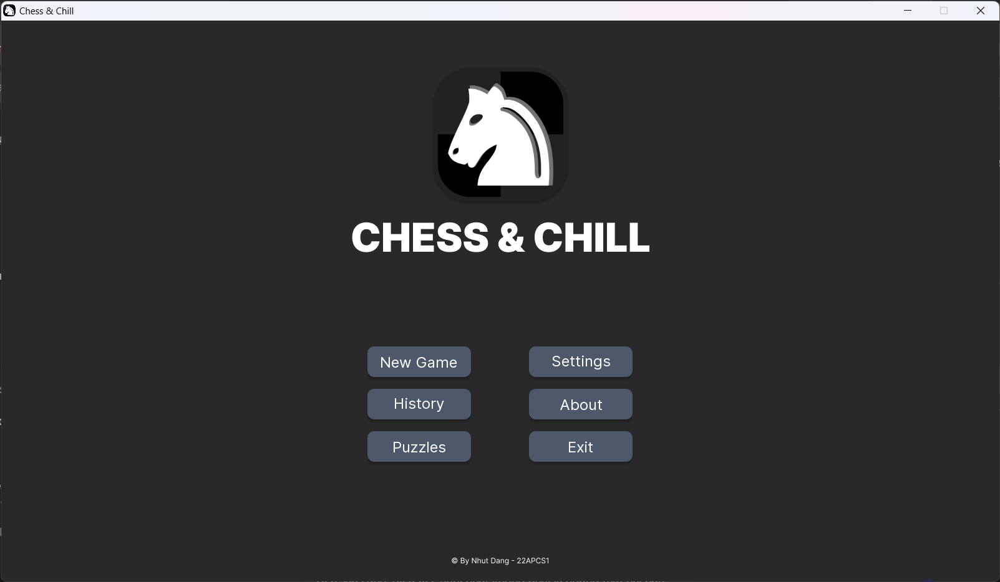
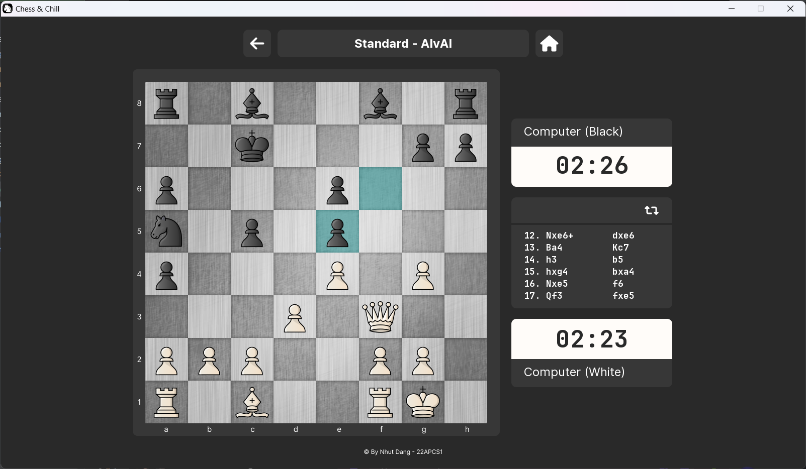
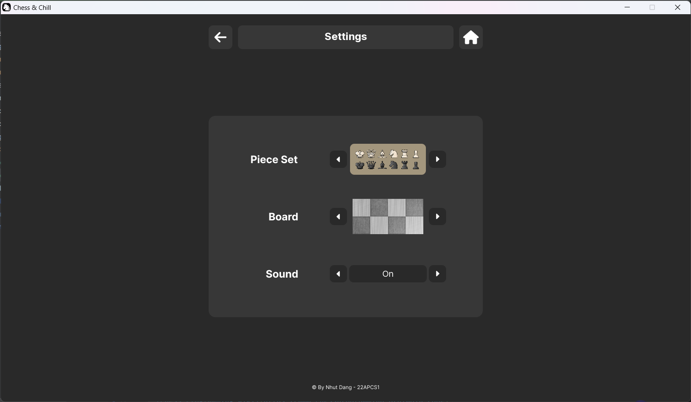
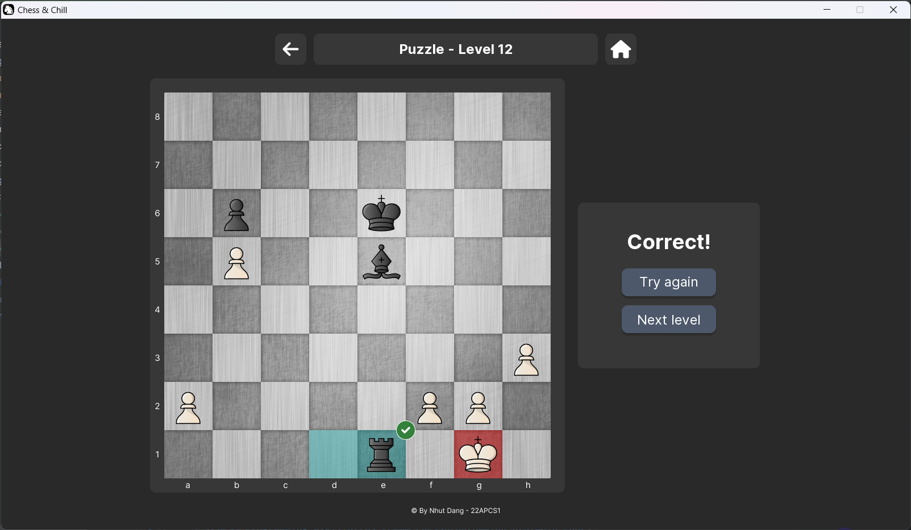
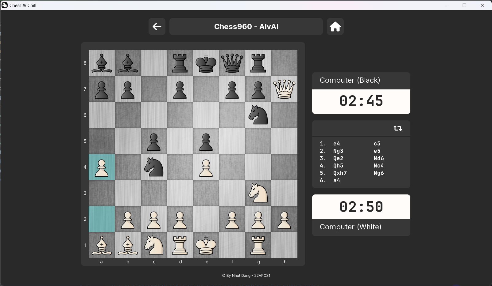
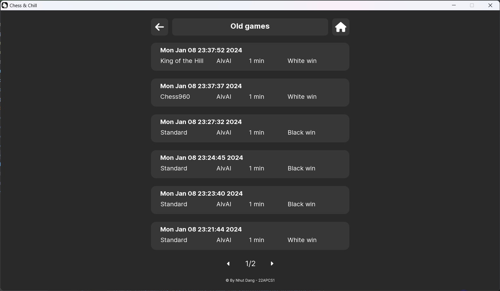

# Chess & Chill - CS202 OOP Project

## 1. Project Description
Author: Nhut Dang - HCMUS - 22APCS1 - 22125071.

This is a CS202 Solo Lab Project using C++. The project is a basic chess game with GUI, that help players learn to play chess. The game also have a chess engine that can play against the player, and analyze the board. The game also provides chess puzzles, chess variations, and data of played games.

## 2. Features
- [x] Basic chess game with GUI.
- [x] **3** game modes: Player vs Player, Player vs Computer, Computer vs Computer.
- [x] Multiple time limit options: 1 min, 3 mins, 5 mins, 10 mins, 15 mins, 30 mins,...
- [x] Chess engine that can play against the player, and analyze the board.
- [x] **100** chess puzzles (read from .csv file)
- [x] **2** chess variations.
  - [Chess960](https://vi.wikipedia.org/wiki/Chess960).
  - [King of the Hill](https://www.chess.com/terms/king-of-the-hill).
- [x] Save & load old games for reviewing (using binary file).
- [x] Customizable game settings.
   - [x] **9** board themes
   - [x] **8** piece sets themes
   - [x] Sound on/off

## 3. Screenshots & Demo
- Youtube demo [here](https://youtu.be/e0gAHI-9Wgw).
- Screenshots:
  - Main menu:

    
  - Game:
    
  - 
  - Game settings:
    
  - 
  - Puzzle:
    
  - 
  - Variation:
    
  - 
  - Old games data:
    
  - 

## 4. How to run 
### 4.1. Build from source
- Clone the repository.
- Open the project in Visual Studio (or any IDE).
- Build the project.
- Run the executable file.

### 4.2. Run the executable file (Windows only)
- Download the `ChessChill_vx.x.zip` file from a release [here](https://github.com/BJMinhNhut/Chess/releases).
- Extract the zip file.
- Run the `Chess-Chill.exe` file.

## 5. References
- [Chess Programming Wiki](https://www.chessprogramming.org/Main_Page)
- [Ameye's blog](https://ameye.dev/notes/chess-engine/)
- [Lichess puzzle database](https://www.kaggle.com/datasets/reinism/lichess-database-puzzles)
- [Lichess themes](https://github.com/lichess-org/lila/tree/master/public)
- [Chess.com sound effects](https://www.chess.com/forum/view/general/chessboard-sound-files)